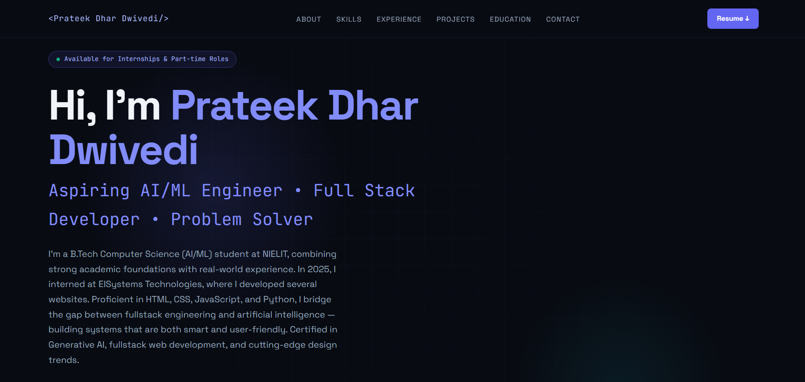

#  Prateek Dhar Dwivedi — Portfolio

<div align="center">

### 👨‍💻 AI/ML Engineer • Full Stack Developer • Problem Solver

A modern, responsive developer portfolio built to showcase my **projects, technical skills, experience, education, certifications, and achievements**.

[🌐 Live Portfolio](https://prateek-dhar-dwivedi.github.io/-Portfolio/) • [💻 GitHub](https://github.com/Prateek-Dhar-Dwivedi)

</div>

---

## ✨ About The Project

This repository contains my personal portfolio website.

The website is designed with a **modern dark developer aesthetic**, featuring neon gradients, responsive layouts, smooth scrolling, interactive project filtering, animated technology cards, and a professional contact section.

The portfolio focuses on my journey as a **Computer Science Engineering student specializing in Artificial Intelligence & Machine Learning**, while also highlighting my experience in full-stack web development.

---

## 🎨 Preview

<p align="center">
  
</p>

---

## ⚡ Features

* 🌑 Modern dark-themed UI
* 📱 Fully responsive design
* 🎯 Interactive project filtering
* 🚀 Animated technology marquee
* 👨‍💻 About Me section
* 🛠️ Skills & Technologies
* 💼 Experience timeline
* 📂 Featured Projects
* 🎓 Education & Certifications
* 🔗 Social media integration
* 📩 Contact form
* ✨ Smooth scrolling
* 🎨 CSS hover animations
* 🌐 Live project links
* 🐙 GitHub repository links

---

## 🛠️ Tech Stack

### Frontend


### Libraries & Tools


### Deployment


---

## 📂 Project Structure

```text
-Portfolio/
│
├── index.html
├── logo.jpeg
├── profile.png
│
├── ProjectPic/
│   ├── Portfolio.png
│   ├── UReact.png
│   ├── UPython.png
│   ├── Cineora.png
│   ├── Velora.png
│   └── TruthLens.png
│
└── README.md
```

---

## 🧩 Sections

### 🏠 Hero

Introduces me as an aspiring **AI/ML Engineer and Full Stack Developer**, along with quick statistics and the technologies I work with.

### 👨‍💻 About

A brief introduction to my background, interests, and focus areas including:

* Artificial Intelligence
* Machine Learning
* Deep Learning
* Data Science
* Full Stack Development
* Cloud Deployment

### 🛠️ Skills

The portfolio categorizes my technical skills into areas such as:

* Programming Languages
* Full Stack Development
* Databases
* UI/UX
* AI/ML

### 💼 Experience

Includes my internship experience at:

* **Cognifyz Technologies** — Machine Learning Intern
* **EISystems Technologies** — Web Developer Intern

### 🚀 Projects

The project section includes interactive filtering for:

```text
⭐ All
🌐 Web Development
🚀 Full Stack
🤖 Machine Learning
🐍 Python
```

Some featured projects include:

| Project          | Description                                  |
| ---------------- | -------------------------------------------- |
| 🌐 Portfolio     | Personal developer portfolio                 |
| 🚀 NIELIT MERN   | Full-stack institutional platform            |
| 🐍 NIELIT Python | Python web application                       |
| 🎬 CINEORA       | ML-powered movie recommendation system       |
| 💼 VELORA        | AI-powered job recommendation platform       |
| 🔍 TruthLens     | AI-powered misinformation detection platform |

---

## 🎓 Education & Certifications

The portfolio also contains my academic background and certifications, including:

* 🎓 B.Tech CSE — AI & ML
* 🤖 Machine Learning Internship
* 🧠 Gen AI Study Jam
* 🎨 Future of UI
* 💻 Full Stack Website Development
* 🏆 Hackathon Certificates
* 🏅 NICEDT Best Poster Award
* 📜 Author Certificate

---

## 📩 Contact

The website includes a contact section where visitors can connect with me for:

* 💼 Internship opportunities
* 🤝 Collaborations
* 🚀 Projects
* 💻 Freelance opportunities
* 🧠 AI/ML discussions

### Connect With Me

<p align="center">

<a href="https://linkedin.com/in/prateek-dhar-dwivedi">

</a>

<a href="https://github.com/Prateek-Dhar-Dwivedi">

</a>

<a href="https://twitter.com/prateekdhard">

</a>

<a href="https://medium.com/@prateekdhardwivedi">

</a>

</p>

---

## 🚀 Run Locally

Clone the repository:

```bash
git clone https://github.com/Prateek-Dhar-Dwivedi/-Portfolio.git
```

Navigate to the project:

```bash
cd -Portfolio
```

Open `index.html` in your browser.

Or use **VS Code Live Server** for a better development experience.

---

## 🌐 Deployment

This portfolio is deployed using **GitHub Pages**.

### Deploy Your Own Version

1. Fork this repository.
2. Clone it locally.
3. Customize `index.html`.
4. Replace the profile and project images.
5. Update your social links.
6. Push your changes to GitHub.
7. Enable **GitHub Pages** from repository settings.

---

## 🎯 Future Improvements

Planned improvements include:

* [ ] Add downloadable resume
* [ ] Add dark/light theme toggle
* [ ] Add more AI/ML projects
* [ ] Add GitHub API integration
* [ ] Add project search
* [ ] Add animations using JavaScript
* [ ] Improve accessibility
* [ ] Add dedicated project detail pages
* [ ] Add backend-powered contact system

---

## ⭐ Support

If you like this portfolio or find it useful, consider giving the repository a ⭐ on GitHub!

---

<div align="center">

### 💙 Built with HTML, CSS & JavaScript

**Prateek Dhar Dwivedi**

*AI/ML Engineer • Full Stack Developer*

</div>
